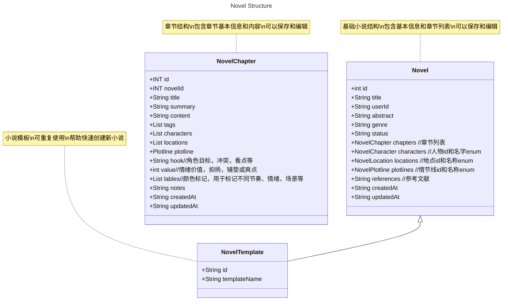

```mermaid
---
title: Novel Structure
---
classDiagram
    note for Novel "基础小说结构\n包含基本信息和章节列表\n可以保存和编辑"
    Novel <|-- NovelTemplate
    note for NovelTemplate "小说模板\n可重复使用\n帮助快速创建新小说"
    Novel : +int id
    Novel : +String title
    Novel : +String userId
    Novel : +String abstract
    Novel : +String genre
    Novel : +String status
    Novel : +NovelChapter chapters //章节列表
    Novel : +NovelCharacter characters //人物id和名字enum
    Novel : +NovelLocation locations //地点id和名称enum
    Novel : +NovelPlotline plotlines //情节线id和名称enum
    Novel : +String references //参考文献
    Novel : +String createdAt
    Novel : +String updatedAt

    class NovelTemplate{
        +String id
        +String templateName    
    }
    
    note for NovelChapter "章节结构\n包含章节基本信息和内容\n可以保存和编辑"
    class NovelChapter{
        +INT id
        +INT novelId
        +String title
        +String summary
        +String content
        +List<Tag> tags
        +List<NovelCharacter> characters
        +List<NovelLocation> locations
        +Plotline plotline
        +String hook//角色目标，冲突，看点等
        +int value//情绪价值，抑扬，铺垫或爽点
        +List<Lable> lables//颜色标记，用于标记不同节奏、情绪、场景等
        +String notes
        +String createdAt
        +String updatedAt
    }

```